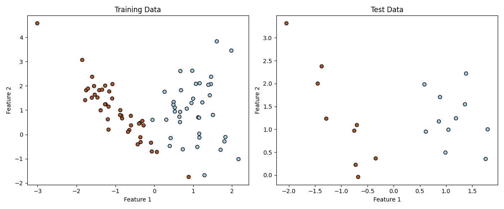
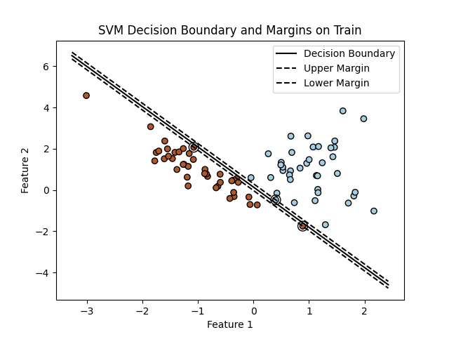
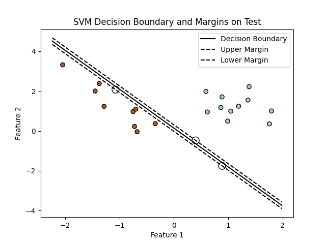
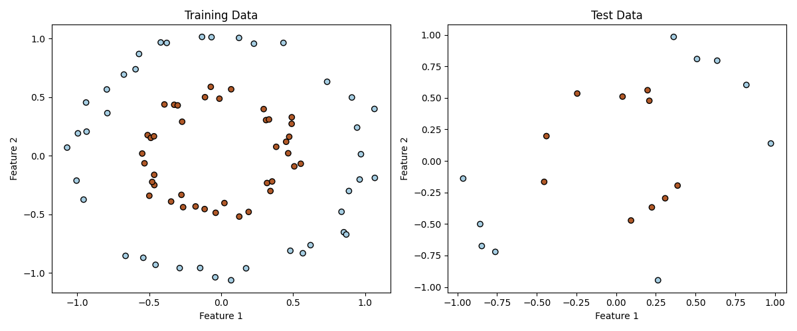
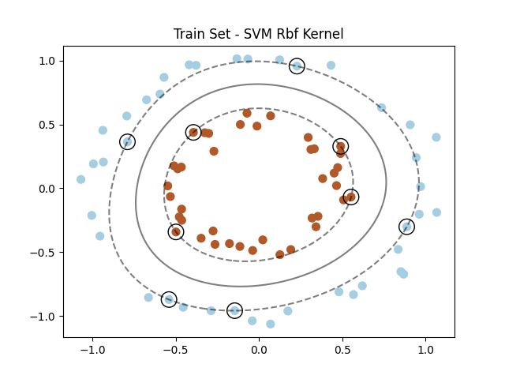
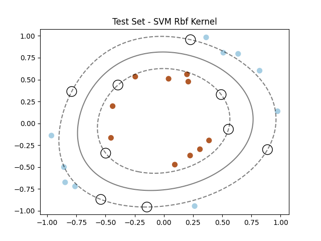

This is an SVM implementation with numpy and the quadratic programming framework CVXOPT.

## Introduction
The Support Vector Machine (SVM), proposed by Vladimir Vapnik and Alexey Chervonenkis in the early 1960s but not published until 1995[^1], is an algorithm designed to classify data points of two discrete classes by discovering the optimal hyperplane to separate them in an n-dimensional space.

## Mathematical Modeling
The mathematical modelling of the problem is as follows:
The classes $y_{i}$ are defined as +1 for positive and -1 for negative. 

In order to define the Hyperplane, we need to calculate a weight W and a bias b such as:
$$\vec{W} \cdot \vec{x}_{\text{+}} + b \geq 1$$

$$\vec{W} \cdot \vec{x}_{\text{-}} + b \leq -1$$

To simplify these two expressions we can multiply them with $y_{i}$ and end up with a singular inequality to cover both cases:
$$y_{i} \cdot (\vec{W} \cdot \vec{x}_{i} + b) \geq 1 \implies$$

$$y_{i} \cdot (\vec{W} \cdot \vec{x}_{i} + b) - 1 \geq 0$$

And we define $y_{i} \cdot (\vec{W} \cdot \vec{x}_{i} + b) - 1 = 0$, (1) for every datapoint that is exactly on the allowed margin from the Hyperplane.

Now in order to get the equation of the width of the margin we can see that $\text{width} = (\vec{x_{+}} - \vec{x_{-}}) \cdot {\vec{W} \over \lVert \vec{W} \rVert}$, but from (1) we can end up with $width = {2 \over \lVert \vec{W} \rVert}$ and we need to maximize this margin. This is the same with maximizing ${1 \over \lVert \vec{W} \rVert}$ or minimizing $\lVert \vec{W} \rVert$.

For the convenience of our mathematic solution we decide to convert our minimization target to ${1 \over 2} \cdot \lVert \vec{W} \rVert^2$.

We have reached to a point where we have to find the extremum of a function with constraints. This can be achieved with Lagrange multipliers:

$L(\mathbf{W}, b, \boldsymbol{\alpha}) = \frac{1}{2} \lVert \mathbf{W} \rVert^2 - \sum_{i=1} \alpha_i \left[ y_i (\vec{W} \cdot \vec{x}_i + b) - 1 \right]$

By setting the partial derivatives of this function to 0 we can find the extremum we are looking for. So we have:

${\partial L \over \partial \vec{W}} = \vec{W} - \sum_{i=1} \alpha_i y_i \vec{x}_i = 0 \implies$ 

$\vec{W} = \sum_{i=1} \alpha_i y_i \vec{x}_i$

and 

${\partial L \over \partial b} = - \sum_{i=1} \alpha_i y_i = 0 \implies$

$\sum \alpha_i y_i = 0$

The problem we came up with is called a quadratic optimization problem and can be solved using a computer. The CVXOPT library is used in the code of this repository to implement our solution.

The above mathematics are just the foundation of the SVM classifier. The code contains also implementation of the **soft margin** and **gaussian kernel trick**.

## SVM Classifier Implementation
This implementation includes an SVM module with Linear and Gaussian kernels and a test to showcase its abillity to classify synthetic data.

### Linearly Separable Data

  

| Training Set | Test Set |
|--------------|----------|
|  |  |

### Non-linearly Separable Data

| Training Set | Test Set |
|--------------|----------|
|  |  |

## References
[^1]:Cortes, Corinna, and Vladimir Vapnik. "Support-vector networks." Machine learning 20 (1995): 273-297.
